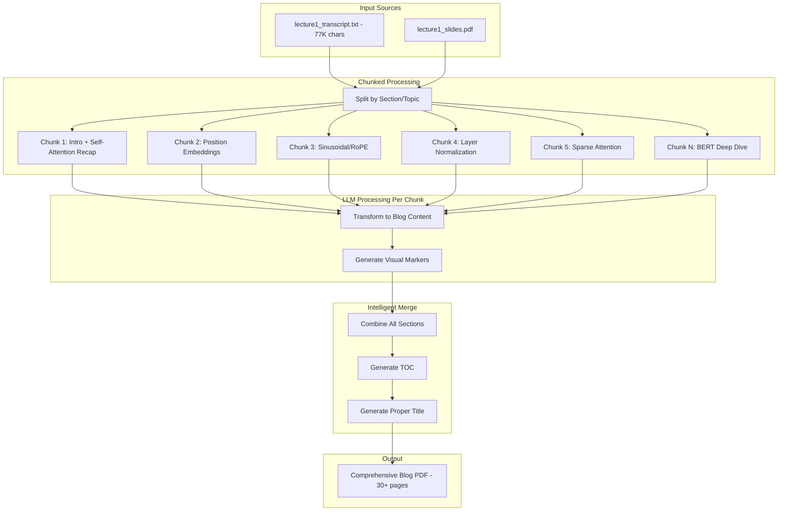

# Full Content Chunked Processing for Comprehensive PDF

## Problem Analysis

Current issues causing the short 10-page PDF:

1. **Truncation**: `llm_content_generator.py` line 120-121 truncates content to 15,000 chars - loses 80% of the 77,054 char transcript
2. **Single file**: Test ran on transcript only, not using `generate_from_folder.py` for both files
3. **Poor title**: Title derived from filename ("lecture1_transcript") instead of descriptive title
4. **Missing content**: Only first ~20% of lecture content is being transformed

## Solution Architecture



## Key Changes

### 1. Update `llm_content_generator.py` - Chunked Processing

Replace the truncation approach with intelligent chunking:

```python
def generate_blog_content(self, raw_content: str, ...) -> GeneratedContent:
    # Instead of: content_chunk = raw_content[:15000]
    # Do: Process in topic-based chunks
    
    chunks = self._split_into_chunks(raw_content, max_chunk_size=12000)
    all_sections = []
    all_markers = []
    
    for i, chunk in enumerate(chunks):
        generated = self._process_chunk(chunk, chunk_index=i, total_chunks=len(chunks))
        all_sections.append(generated.markdown)
        all_markers.extend(generated.visual_markers)
    
    # Merge and generate cohesive document
    return self._merge_chunks(all_sections, all_markers, topic)
```

Chunking strategy:

- Split by natural section breaks (timestamps showing topic changes, "Introduction", "Recap", etc.)
- Target ~12,000 chars per chunk for safe LLM processing
- Preserve context headers between chunks

### 2. Add Title Generation Method

Add a method to generate a proper descriptive title:

```python
def generate_title(self, content: str, topic_hint: str = "") -> str:
    """Generate a descriptive title like 'Transformer Internals: What Changed Since 2017'"""
    prompt = f"""Based on this content, generate a professional blog post title.
    The title should:
  - Be descriptive and engaging (5-10 words)
  - Follow pattern: "Main Topic: Subtitle" 
  - Not include course names or file names
    
    Content preview: {content[:3000]}
    Topic hint: {topic_hint}
    
    Return ONLY the title, nothing else."""
```

### 3. Update `content_merger.py` for Two-File Processing

Ensure both transcript AND slides are processed:

```python
def merge_folder_content(parsed_contents, folder_name, llm_service):
    # Combine ALL content from ALL files
    all_content = []
    for content in parsed_contents:
        all_content.append(content.get("raw_content", ""))
    
    combined = "\n\n---\n\n".join(all_content)
    
    # Process combined content with chunking
    content_generator = get_content_generator()
    generated = content_generator.generate_blog_content_chunked(
        raw_content=combined,
        content_type="mixed",  # transcript + slides
        topic=folder_name
    )
```

### 4. Match Template PDF Style

Based on `dev/llm-architectures.md` (which mirrors the template style):

- **Section Headers**: Use numbered sections (1. DeepSeek, 1.1 MLA, etc.)
- **Figures**: Reference figures inline (Figure 1, Figure 2)
- **Code Examples**: Include code snippets where relevant
- **Comparisons**: Side-by-side feature comparisons
- **Navigation Tips**: Add reading guidance

Update the LLM prompt to match this style in `_build_generation_prompt()`.

## Files to Modify

| File | Changes |

|------|---------|

| [`src/doc_generator/infrastructure/llm_content_generator.py`](src/doc_generator/infrastructure/llm_content_generator.py) | Add chunked processing, title generation, section-aware splitting |

| [`src/doc_generator/utils/content_merger.py`](src/doc_generator/utils/content_merger.py) | Use chunked generator for multi-file merging |

| [`src/doc_generator/application/nodes/transform_content.py`](src/doc_generator/application/nodes/transform_content.py) | Pass full content to chunked processor |

## Expected Output

- **Title**: "Transformer Architecture Internals: From Self-Attention to Modern Variations"
- **Length**: 30-40 pages (vs current 10)
- **Sections**: 
                                                                                                                                                                                                                                                                - Introduction and Transformer Recap
                                                                                                                                                                                                                                                                - Position Embeddings (Learned, Sinusoidal, RoPE, ALiBi)
                                                                                                                                                                                                                                                                - Layer Normalization (Pre-norm, RMSNorm)
                                                                                                                                                                                                                                                                - Attention Variations (Sparse, Sliding Window, GQA, MQA)
                                                                                                                                                                                                                                                                - BERT and Encoder-Only Models
                                                                                                                                                                                                                                                                - Extensions (DistilBERT, RoBERTa)
- **Visuals**: 5-8 diagrams (architecture, attention maps, comparisons)
- **Style**: Numbered sections, inline figures, professional formatting

## Testing

```bash
python scripts/generate_from_folder.py src/data/llm-architectures --verbose
```

Verify:

- Both files processed (transcript + slides)
- Full 77K chars transformed (no truncation)
- PDF is 30+ pages
- Title is descriptive
- All major topics covered