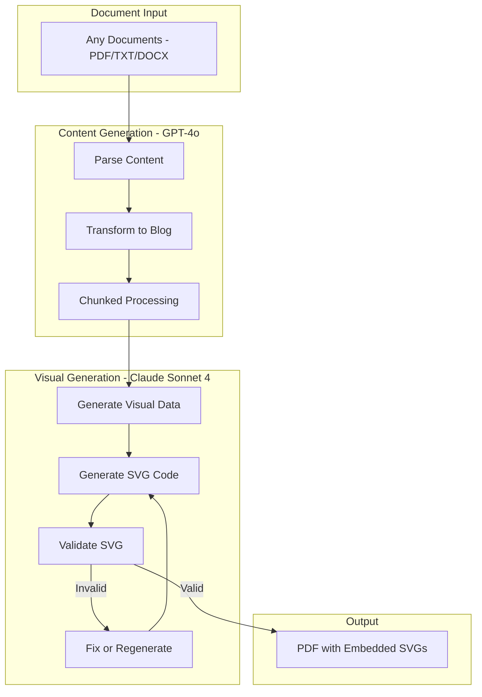

# SVG Fix, Validation Loop, and Code Reorganization

## Problem Analysis

### 1. SVG Images Not Showing in PDF

The test logs show visual markers are generated with type "diagram" which isn't recognized:

```
Unknown visualization type for Claude: diagram
Failed to generate SVG for: Self-Attention Overview
No visualization found for marker: Self-Attention Overview
```

Root causes:

- Type mapping was added but not all code paths handle it
- [`claude_svg_generator.py`](src/doc_generator/infrastructure/claude_svg_generator.py) line 490 returns empty string for unknown types
- PDF generator shows placeholders when visualization path is missing

### 2. Current Model Configuration

Currently both content and SVG use Claude. Need to split:

- **SVG generation**: Claude Sonnet 4 (`claude-sonnet-4-20250514`)
- **Content generation**: GPT-4o (`gpt-4o`)

## Solution Architecture



## Key Changes

### 1. Fix SVG Generation and Embedding

**File**: [`src/doc_generator/infrastructure/claude_svg_generator.py`](src/doc_generator/infrastructure/claude_svg_generator.py)

- Add handling for "comparison" type (currently only supports "comparison_visual")
- Log more details when generation fails
- Return fallback basic SVG instead of empty string

**File**: [`src/doc_generator/application/nodes/generate_visuals.py`](src/doc_generator/application/nodes/generate_visuals.py)

- Integrate SVG validation with retry loop (max 3 attempts)
- If validation fails after retries, use basic fallback SVG

### 2. Add SVG Validation Loop

**File**: [`src/doc_generator/application/nodes/generate_visuals.py`](src/doc_generator/application/nodes/generate_visuals.py)

```python
def _generate_with_validation(marker, data, output_path, max_retries=3):
    for attempt in range(max_retries):
        svg_content = generate_visualization_with_claude(...)
        result = validate_svg(svg_content)
        
        if result.is_valid and not result.warnings:
            return svg_content
        
        if result.has_critical_errors:
            # Regenerate with feedback
            data["validation_feedback"] = result.errors
        else:
            # Minor issues - fix and continue
            svg_content, _ = validator.validate_and_fix(svg_content)
            return svg_content
    
    return _create_fallback_svg(...)
```

### 3. Separate Model Configuration

**File**: [`src/doc_generator/infrastructure/settings.py`](src/doc_generator/infrastructure/settings.py)

Update `LlmSettings` class:

```python
class LlmSettings(BaseSettings):
    # Content generation (GPT-4o)
    content_model: str = "gpt-4o"
    content_provider: str = "openai"
    
    # SVG generation (Claude Sonnet 4)
    svg_model: str = "claude-sonnet-4-20250514"
    svg_provider: str = "claude"
```

**File**: [`src/doc_generator/infrastructure/llm_content_generator.py`](src/doc_generator/infrastructure/llm_content_generator.py)

- Use OpenAI GPT-4o for content transformation
- Keep Claude for visual data structure generation

### 4. Move Prompts to Config Folder

Create new structure:

```
src/doc_generator/config/
  - __init__.py
  - prompts/
    - __init__.py
    - content_prompts.py      # Blog transformation prompts
    - visual_prompts.py       # SVG generation prompts
    - summary_prompts.py      # Executive summary prompts
  - settings.py               # Move from infrastructure/
```

### 5. Remove Unused Code

Files/functions to review and potentially remove:

- [`src/doc_generator/utils/figure_parser.py`](src/doc_generator/utils/figure_parser.py) - Legacy fallback, may be unused
- [`src/doc_generator/infrastructure/markitdown_adapter.py`](src/doc_generator/infrastructure/markitdown_adapter.py) - Check if used
- Unused imports in various files
- Dead code paths in generate_visuals.py (legacy LLM suggestions)

### 6. Generic Workflow Support

**File**: [`src/doc_generator/application/graph_workflow.py`](src/doc_generator/application/graph_workflow.py)

- Ensure workflow handles any input format dynamically
- Remove hardcoded assumptions about document types

## Files to Modify

- [`src/doc_generator/infrastructure/claude_svg_generator.py`](src/doc_generator/infrastructure/claude_svg_generator.py) - Fix type handling, add fallbacks
- [`src/doc_generator/application/nodes/generate_visuals.py`](src/doc_generator/application/nodes/generate_visuals.py) - Add validation loop
- [`src/doc_generator/infrastructure/llm_content_generator.py`](src/doc_generator/infrastructure/llm_content_generator.py) - Use GPT-4o
- [`src/doc_generator/infrastructure/settings.py`](src/doc_generator/infrastructure/settings.py) - Split model config

## New Files to Create

- `src/doc_generator/config/__init__.py`
- `src/doc_generator/config/prompts/__init__.py`
- `src/doc_generator/config/prompts/content_prompts.py`
- `src/doc_generator/config/prompts/visual_prompts.py`
- `src/doc_generator/config/prompts/summary_prompts.py`

## Testing

After implementation:

```bash
python scripts/run_generator.py src/data/llm-architectures/lecture1_transcript.txt --output pdf --verbose
```

Verify:

- SVG images appear in PDF (not placeholders)
- Validation warnings in logs for regenerated SVGs
- Content generated by GPT-4o, SVGs by Claude
- No import errors after code reorganization