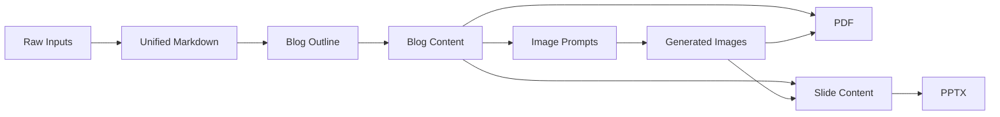

# Document Generator - Simplified Process Flow

## Simple Overview

```mermaid
graph TD
    A[Input Sources\nPDF, DOCX, Markdown, URL, Copied Text] --> B[Convert Each Source to Markdown]
    B --> C[Combine into Single Markdown]
    C --> D[LLM: Generate Blog Outline]
    D --> E[LLM: Generate Blog Content\n(Strictly from Source)]
    E --> F[LLM: Section Image Prompts]
    F --> G[Image Generation\nDiagrams, Comparisons, Notes, Mermaid]
    E --> H[PDF Generator]
    G --> H
    E --> I[LLM: Slide Content from Blog]
    G --> I
    I --> J[PPTX Generator]
    H --> K[Blog-Style PDF]\n
    J --> L[Presentation-Ready PPTX]
```

## Step-by-Step Flow

1. **Ingest sources**: PDF, DOCX, Markdown, URL, or copied text.
2. **Normalize to markdown**: Each source is parsed and converted into markdown.
3. **Merge**: All markdown is combined into a single document.
4. **Outline first**: The LLM produces a blog outline from the merged markdown.
5. **Blog generation**: The LLM writes the full blog strictly using the input content.
6. **Per-section prompts**: For each section, the LLM generates image prompts.
7. **Visuals**: Image models generate diagrams, comparisons, handwritten notes, or mermaid visuals.
8. **PDF output**: Blog content + visuals are assembled into a blog-style PDF.
9. **PPTX output**: Slide content is generated from the blog and paired with visuals.
10. **Alignment**: Images are embedded in both PDF and PPTX alongside their sections.

## Data Flow Summary


