# Document Generator - Complete Process Flow

## Overview Architecture Diagram

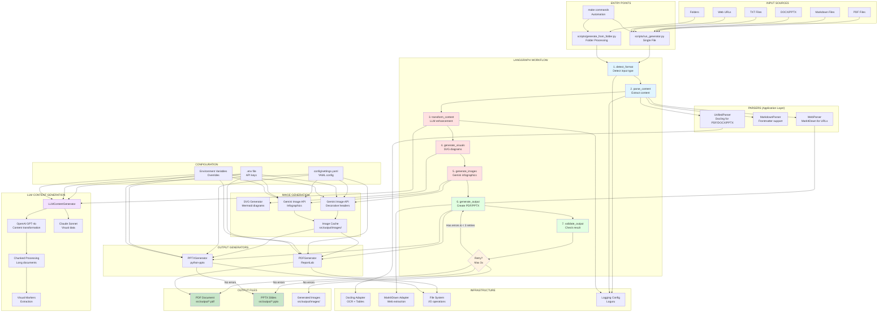

## Detailed Process Flow

### Phase 1: Input & Detection

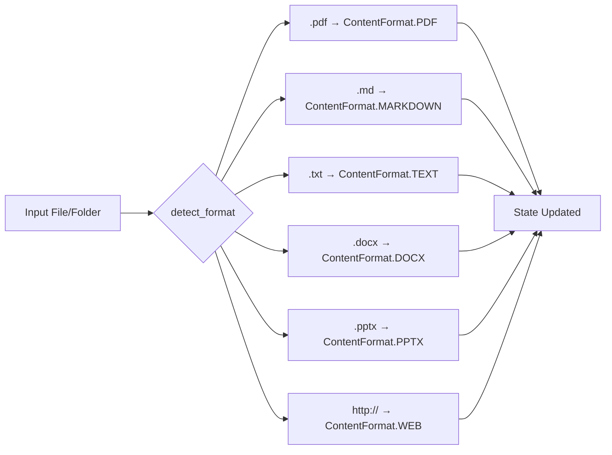

### Phase 2: Content Parsing

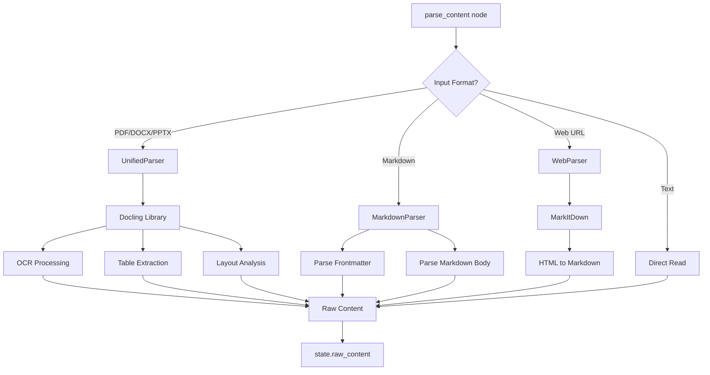

### Phase 3: LLM Content Transformation

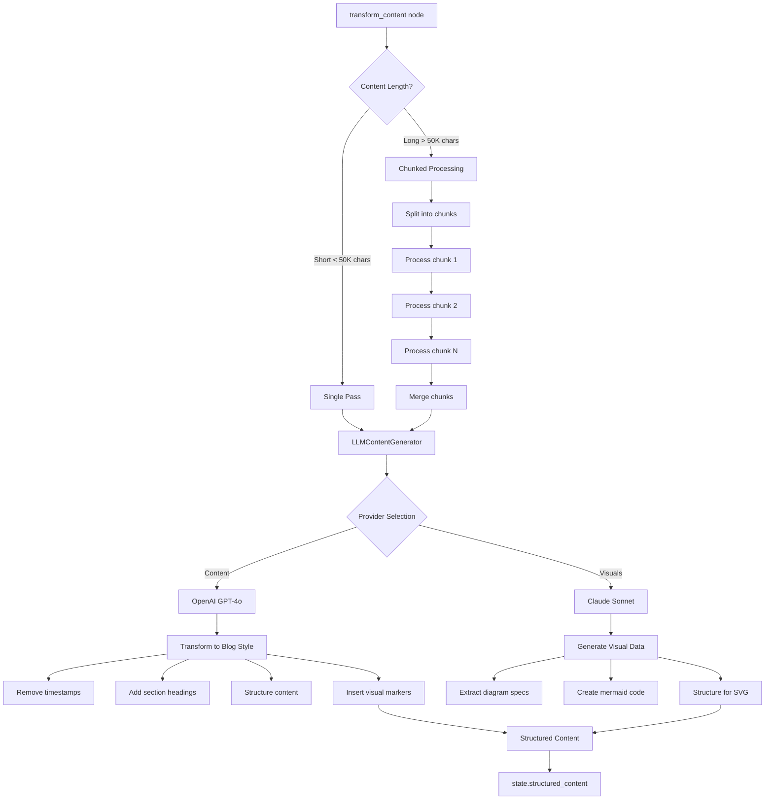

### Phase 4: Visual Generation

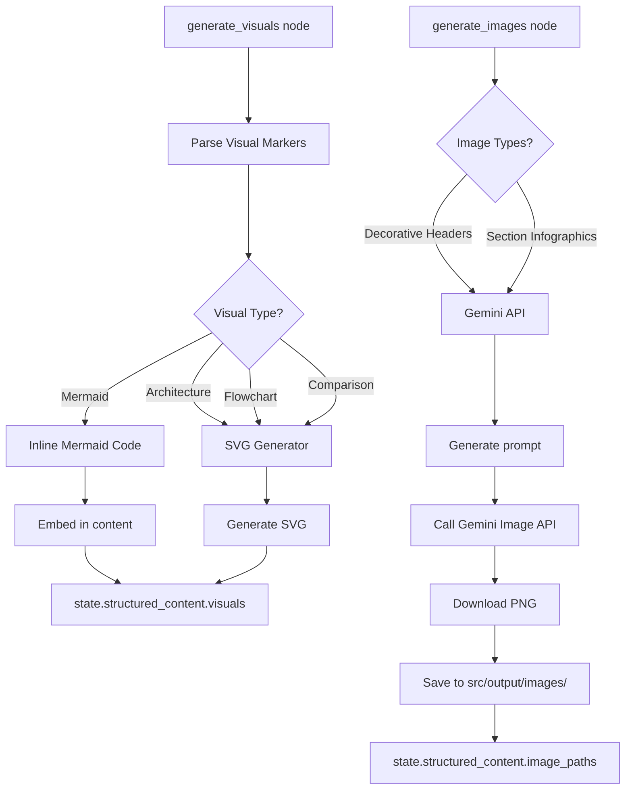

### Phase 5: Output Generation

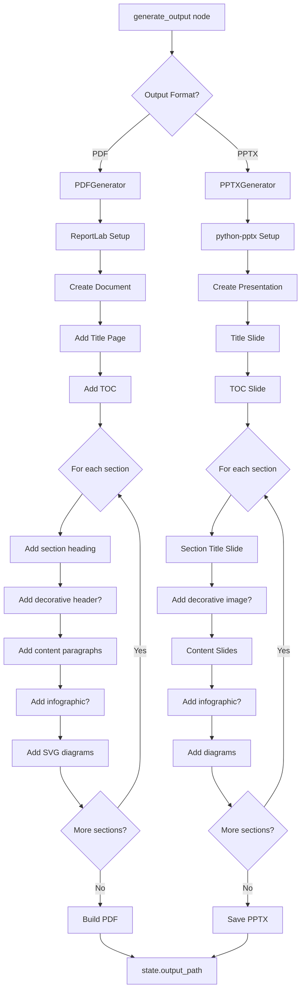

### Phase 6: Validation & Retry

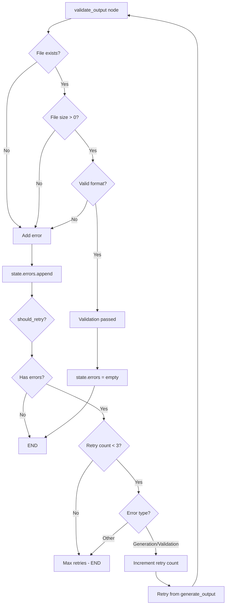

## Folder Processing Flow

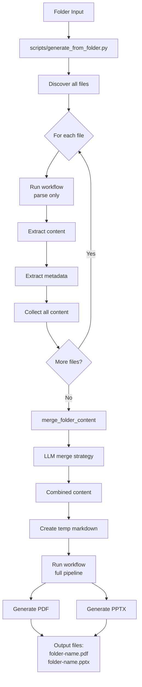

## Data Flow Summary

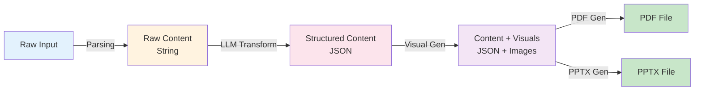

## Architecture Layers

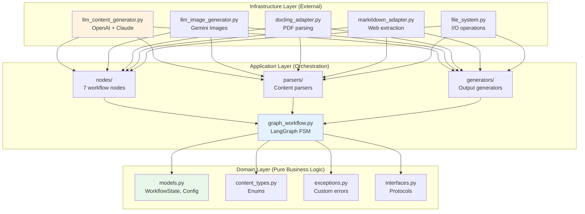

## Technology Stack Flow

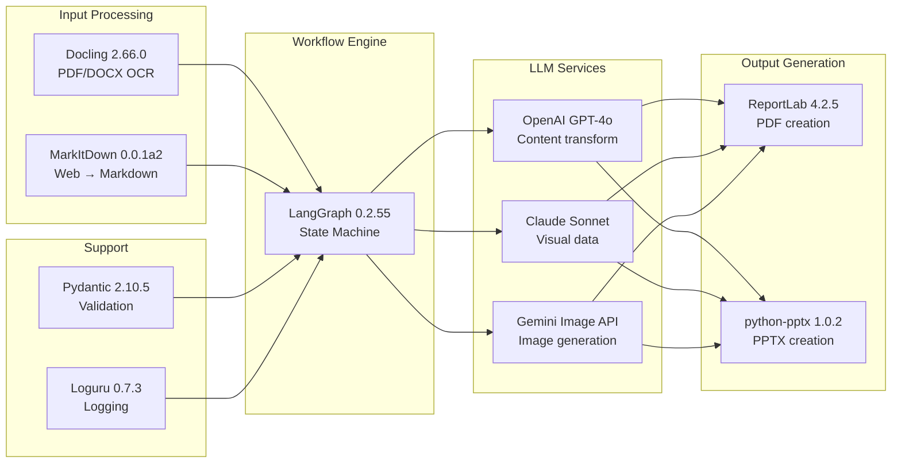

## Key Features

### 1. **Clean Architecture**
- **Domain**: Zero external dependencies (pure business logic)
- **Application**: Orchestration and use cases
- **Infrastructure**: External integrations (APIs, file I/O)

### 2. **LangGraph Workflow**
- 7-node state machine
- Automatic retry on errors (max 3 attempts)
- Conditional branching for retry logic

### 3. **Multi-Format Support**
- **Input**: PDF, DOCX, PPTX, Markdown, TXT, Web URLs
- **Output**: PDF (ReportLab) and PPTX (python-pptx)

### 4. **Advanced Parsing**
- **Docling**: OCR, table extraction, layout analysis for PDFs
- **MarkItDown**: Web content to Markdown conversion

### 5. **LLM Enhancement**
- **OpenAI GPT-4o**: Content transformation to blog style
- **Claude Sonnet**: Visual data generation
- **Chunked processing**: Handles long documents (>50K chars)

### 6. **Image Generation**
- **SVG**: Mermaid diagrams for architecture/flowcharts
- **Gemini**: Decorative headers and infographics
- **Caching**: Reuses generated images across runs

### 7. **Folder Processing**
- Combines multiple files into single output
- Intelligent content merging via LLM
- One PDF + One PPTX per folder

### 8. **Configuration**
- **settings.yaml**: Core configuration
- **.env**: API keys (never committed)
- **Environment vars**: Runtime overrides

### 9. **Error Handling**
- Comprehensive logging (Loguru)
- Automatic retry with backoff
- Validation at every step

### 10. **Docker Ready**
- Fully containerized
- Volume mounts for data and output
- Production-ready deployment

## File Locations

```
src/data/                      # Input files and folders
src/output/                    # Generated outputs
  ├── *.pdf                    # PDF documents
  ├── *.pptx                   # PowerPoint presentations
  └── images/                  # Generated images
      ├── section_*_header.png
      └── section_*_infographic.png

config/settings.yaml           # Configuration
.env                          # API keys (not committed)
scripts/                      # Entry point scripts
Makefile                      # Automation commands
```

## Command Reference

```bash
# Single file processing
make run INPUT=src/data/file.md OUTPUT=pdf

# Folder processing (combines all files)
make process-folder FOLDER=llm-architectures

# Batch process all folders
make batch-topics

# Setup and maintenance
make setup                    # Install dependencies
make test                     # Run tests
make lint                     # Format and lint
make clean                    # Clean outputs
```

## Environment Variables

```bash
# Required for LLM features
OPENAI_API_KEY=sk-...         # OpenAI for content
ANTHROPIC_API_KEY=sk-ant-...  # Claude for visuals
GEMINI_API_KEY=...            # Gemini for images

# Optional overrides
DOC_GENERATOR_LLM__MODEL=gpt-4o
DOC_GENERATOR_PDF__PAGE_SIZE=a4
DOC_GENERATOR_LOGGING__LEVEL=DEBUG
```

## Performance Notes

- **Parsing**: Fast (< 5 seconds per file)
- **LLM Transform**: ~30-60 seconds per document
- **Image Generation**: ~10-20 seconds per image
- **PDF/PPTX Creation**: ~5-10 seconds
- **Total**: ~2-5 minutes per document with images

## Future Enhancements

1. ✅ Parallel image generation
2. ✅ Streaming LLM responses
3. ✅ Image caching system
4. ⬜ Multiple LLM provider support
5. ⬜ Custom theme support
6. ⬜ Web UI for configuration
7. ⬜ API endpoint deployment
8. ⬜ Batch processing optimization
