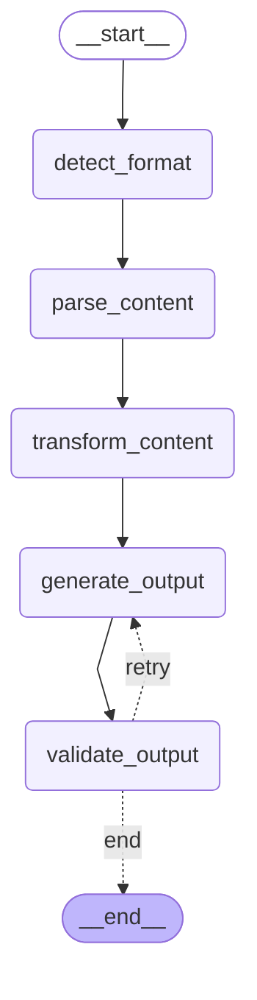
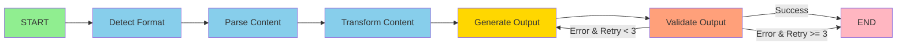

# LangGraph Workflow Visualization

## Summary

**This workflow uses LangGraph for orchestration but NO LLM models** ❌🤖

All processing is done using traditional libraries:
- **Docling** (IBM) - PDF parsing with OCR
- **MarkItDown** (Microsoft) - HTML to markdown
- **ReportLab** - PDF generation
- **python-pptx** - PPTX generation

## Interactive Diagram



## Simplified View



## Node Functions

### 1️⃣ **Detect Format**
```
Input: file path or URL
Logic: Check extension/URL pattern
Output: ContentFormat (MARKDOWN, PDF, URL, etc.)
LLM: ❌ None
```

### 2️⃣ **Parse Content**
```
Input: file path + detected format
Logic:
  - PDF/DOCX → Docling parser
  - Markdown → Python frontmatter
  - URL → MarkItDown
  - TXT → Direct read
Output: raw_content (markdown text), metadata
LLM: ❌ None
```

### 3️⃣ **Transform Content**
```
Input: raw_content, metadata
Logic: Structure data for generators
Output: structured_content {"markdown": "...", "title": "..."}
LLM: ❌ None
```

### 4️⃣ **Generate Output**
```
Input: structured_content, output_format
Logic:
  - PDF → ReportLab (parse markdown → render PDF)
  - PPTX → python-pptx (parse markdown → create slides)
Output: output_path (file location)
LLM: ❌ None
```

### 5️⃣ **Validate Output**
```
Input: output_path
Logic: Check file exists, size > 0, readable
Output: Update errors[] if invalid
LLM: ❌ None
```

### 🔁 **Retry Logic**
```
Condition:
  - If validation fails AND retry_count < 3
  - Only for generation/validation errors
Action: Loop back to "Generate Output"
LLM: ❌ None
```

## Workflow State

```python
{
    "input_path": "src/data/sample.md",
    "input_format": "MARKDOWN",
    "output_format": "pdf",
    "raw_content": "# My Article\n\nContent here...",
    "structured_content": {
        "markdown": "# My Article...",
        "title": "My Article"
    },
    "output_path": "src/output/My_Article.pdf",
    "errors": [],
    "metadata": {"title": "My Article", "author": "John"},
    "_retry_count": 0
}
```

## Example Execution Trace

### Success Case: Markdown → PDF

```
[START]
   ↓
[detect_format]
   input_path: "src/data/article.md"
   → input_format: "MARKDOWN"
   ↓
[parse_content]
   → raw_content: "# Hello\n\nWorld"
   → metadata: {"title": "Hello"}
   ↓
[transform_content]
   → structured_content: {"markdown": "...", "title": "Hello"}
   ↓
[generate_output]
   → output_path: "src/output/Hello.pdf"
   ↓
[validate_output]
   File exists: ✅
   Size: 5KB ✅
   → errors: []
   ↓
[should_retry decision]
   errors: [] → "end"
   ↓
[END] ✅
```

### Retry Case: PDF Generation Fails Twice

```
[START]
   ↓
[detect_format] → "MARKDOWN"
   ↓
[parse_content] → content extracted ✅
   ↓
[transform_content] → structured ✅
   ↓
[generate_output] → FAIL ❌ (disk full)
   ↓
[validate_output]
   File exists: ❌
   → errors: ["Generation failed: No space"]
   ↓
[should_retry decision]
   errors: [1], retry_count: 0 → "retry"
   ↓ (loop back)
[generate_output] → FAIL ❌ (still no space)
   ↓
[validate_output]
   → errors: ["Generation failed: No space"] (2nd time)
   ↓
[should_retry decision]
   retry_count: 1 → "retry"
   ↓ (loop back)
[generate_output] → SUCCESS ✅ (space freed)
   ↓
[validate_output]
   File exists: ✅
   → errors: [] (cleared)
   ↓
[should_retry decision]
   errors: [] → "end"
   ↓
[END] ✅ (succeeded on 3rd attempt)
```

## Why LangGraph Without LLMs?

### Benefits:
1. **State Management**: Clean state passing between nodes
2. **Visualization**: Built-in graph rendering (this diagram!)
3. **Retry Logic**: Simple conditional edges
4. **Extensibility**: Easy to add new nodes
5. **Separation of Concerns**: Each node is isolated
6. **Future-Proof**: Can add LLM nodes later if needed

### LangGraph Features Used:
- ✅ `StateGraph` - state management
- ✅ `add_node` - define processing steps
- ✅ `add_edge` - linear flow
- ✅ `add_conditional_edges` - retry logic
- ✅ `compile()` - create executable graph
- ❌ LLMs - **NOT USED**
- ❌ `langchain-openai` - **NOT INSTALLED**
- ❌ `langchain-anthropic` - **NOT INSTALLED**

## How to View This Diagram

### Option 1: GitHub/GitLab (renders mermaid automatically)
Just open this file in GitHub/GitLab - mermaid diagrams render natively.

### Option 2: VS Code
Install the "Markdown Preview Mermaid Support" extension.

### Option 3: Mermaid Live Editor
1. Copy the mermaid code block above
2. Paste into https://mermaid.live
3. Export as PNG/SVG

### Option 4: Generate PNG Locally
```bash
# Install graphviz
brew install graphviz  # macOS
sudo apt-get install graphviz  # Linux

# Install Python package
pip install pygraphviz

# Run visualization script
python visualize_graph.py
# → Generates langgraph-diagram.png
```

## Code Reference

The workflow is defined in: `src/doc_generator/application/graph_workflow.py:53`

```python
def build_workflow() -> StateGraph:
    workflow = StateGraph(WorkflowState)

    # Add nodes
    workflow.add_node("detect_format", detect_format_node)
    workflow.add_node("parse_content", parse_content_node)
    workflow.add_node("transform_content", transform_content_node)
    workflow.add_node("generate_output", generate_output_node)
    workflow.add_node("validate_output", validate_output_node)

    # Linear flow
    workflow.set_entry_point("detect_format")
    workflow.add_edge("detect_format", "parse_content")
    workflow.add_edge("parse_content", "transform_content")
    workflow.add_edge("transform_content", "generate_output")
    workflow.add_edge("generate_output", "validate_output")

    # Conditional retry
    workflow.add_conditional_edges(
        "validate_output",
        should_retry,
        {"retry": "generate_output", "end": END}
    )

    return workflow.compile()
```

---

**Key Takeaway**: This is a **pure data processing pipeline** using LangGraph as a workflow engine, **not an AI/LLM application**. All transformations are deterministic and rule-based.
