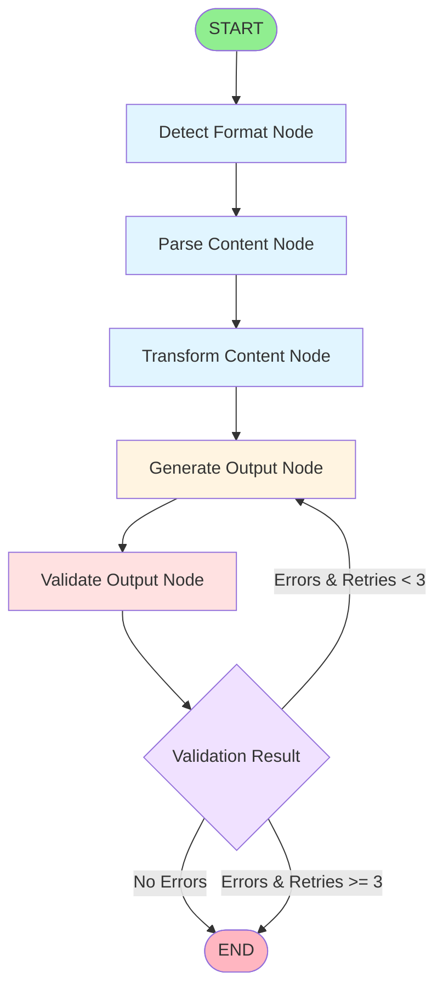
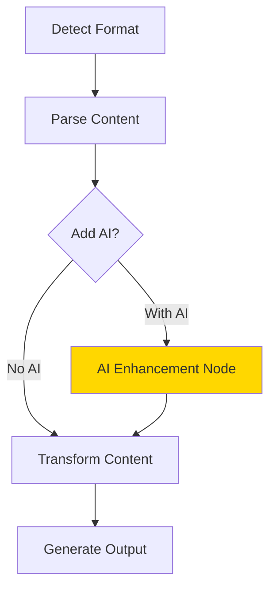

# LangGraph Workflow Diagram

## Visual Flow



## Node Descriptions

### 1. **Detect Format Node** 🔍
- **Purpose**: Identify input file format
- **Input**: File path or URL
- **Logic**:
  - Check file extension (.md, .pdf, .docx, .txt)
  - Check if URL (starts with http/https)
  - Detect content type
- **Output**: `input_format` (MARKDOWN, PDF, DOCX, TXT, URL)
- **LLM Used**: ❌ None (deterministic logic)

### 2. **Parse Content Node** 📄
- **Purpose**: Extract raw content from input
- **Parsers Used**:
  - **Markdown**: Python frontmatter parser
  - **PDF/DOCX/PPTX**: Docling (IBM Research - OCR, tables, layout)
  - **Web URLs**: MarkItDown (Microsoft - HTML to markdown)
  - **TXT**: Direct file read
- **Output**: `raw_content` (markdown text), `metadata` (title, author, etc.)
- **LLM Used**: ❌ None (rule-based parsing)

### 3. **Transform Content Node** 🔄
- **Purpose**: Structure content for generators
- **Logic**:
  - Extract title from metadata
  - Prepare structured dictionary
  - Pass markdown through to generators
- **Output**: `structured_content` with markdown and title
- **LLM Used**: ❌ None (simple data transformation)

### 4. **Generate Output Node** ✨
- **Purpose**: Create PDF or PPTX file
- **Generators**:
  - **PDF**: ReportLab (renders markdown to PDF)
  - **PPTX**: python-pptx (converts markdown to slides)
- **Logic**:
  - Parse markdown into sections/paragraphs
  - Apply styling and formatting
  - Generate document
- **Output**: `output_path` (file location)
- **LLM Used**: ❌ None (template-based generation)

### 5. **Validate Output Node** ✅
- **Purpose**: Verify generated file is valid
- **Checks**:
  - File exists
  - File size > 0 bytes
  - File readable
  - Correct extension
- **Output**: Updates `errors` list if validation fails
- **LLM Used**: ❌ None (file system checks)

### 6. **Retry Logic** 🔁
- **Purpose**: Handle generation/validation failures
- **Conditions**:
  - Retry if: Generation or validation errors
  - Don't retry if: Parsing errors or max retries (3) reached
- **Flow**: Loops back to "Generate Output" node
- **LLM Used**: ❌ None (conditional logic)

## Workflow State Structure

```python
WorkflowState = {
    "input_path": str,           # Input file/URL path
    "input_format": str,         # Detected format (MARKDOWN, PDF, etc.)
    "output_format": str,        # Desired output (pdf or pptx)
    "raw_content": str,          # Extracted markdown content
    "structured_content": dict,  # Structured data for generators
    "output_path": str,          # Generated file path
    "errors": list[str],         # Error messages
    "metadata": dict,            # Title, author, date, etc.
    "_retry_count": int          # Internal retry counter
}
```

## Example Execution Flow

### Scenario: Convert `article.md` to PDF

```
START
  ↓
Detect Format: MARKDOWN
  ↓
Parse Content: Extract markdown + frontmatter → title="My Article"
  ↓
Transform: Structure as {"markdown": "...", "title": "My Article"}
  ↓
Generate Output: ReportLab creates PDF → "src/output/My_Article.pdf"
  ↓
Validate: Check file exists, size=15KB ✅
  ↓
Decision: No errors
  ↓
END (Success!)
```

### Scenario: PDF Generation Fails (with retry)

```
START
  ↓
Detect Format: MARKDOWN
  ↓
Parse Content: Extract content
  ↓
Transform: Structure data
  ↓
Generate Output: PDF generation fails (disk full) ❌
  ↓
Validate: File doesn't exist ❌
  ↓
Decision: Error + retry_count=0 → RETRY
  ↓ (loops back)
Generate Output: Still fails ❌
  ↓
Validate: File doesn't exist ❌
  ↓
Decision: Error + retry_count=1 → RETRY
  ↓ (loops back)
Generate Output: Disk space freed, success! ✅
  ↓
Validate: File exists, size=10KB ✅
  ↓
Decision: No errors
  ↓
END (Success after 2 retries!)
```

## Key Features

### ✅ **No AI/LLM Required**
- 100% deterministic, rule-based processing
- No API keys needed
- No usage costs
- Fully reproducible outputs
- Works offline

### ✅ **Retry Logic**
- Automatically retries on generation failures
- Max 3 attempts
- Only retries generation/validation errors
- Doesn't retry parsing errors (would fail again)

### ✅ **Clean Architecture**
- Each node has single responsibility
- State immutability (nodes return new state)
- Easy to add new nodes or formats
- Testable in isolation

### ✅ **Extensible**
- Add new input formats → new parser in `parsers/`
- Add new output formats → new generator in `generators/`
- Add new nodes → modify `graph_workflow.py`
- Add pre/post-processing → insert nodes in graph

## Technical Details

### LangGraph Implementation

```python
# From graph_workflow.py (simplified)

workflow = StateGraph(WorkflowState)

# Add nodes
workflow.add_node("detect_format", detect_format_node)
workflow.add_node("parse_content", parse_content_node)
workflow.add_node("transform_content", transform_content_node)
workflow.add_node("generate_output", generate_output_node)
workflow.add_node("validate_output", validate_output_node)

# Linear flow
workflow.set_entry_point("detect_format")
workflow.add_edge("detect_format", "parse_content")
workflow.add_edge("parse_content", "transform_content")
workflow.add_edge("transform_content", "generate_output")
workflow.add_edge("generate_output", "validate_output")

# Conditional retry
workflow.add_conditional_edges(
    "validate_output",
    should_retry,  # Decision function
    {
        "retry": "generate_output",  # Loop back
        "end": END                    # Finish
    }
)

graph = workflow.compile()
```

### Why LangGraph (Without LLMs)?

1. **State Management**: Clean state passing between nodes
2. **Workflow Visualization**: Built-in graph visualization
3. **Retry Logic**: Easy conditional edges for error handling
4. **Extensibility**: Add new nodes without refactoring
5. **Separation of Concerns**: Each node is independent
6. **Future-Proofing**: Easy to add LLM nodes later if needed

## Potential LLM Integration Points (Future)

If you wanted to add AI capabilities later, here are logical insertion points:



### Possible AI Enhancements:
- **Content Enhancement**: Improve grammar, clarity, tone
- **Auto-Summarization**: Generate executive summaries
- **Smart Formatting**: AI-driven layout decisions
- **Image Generation**: Create diagrams/illustrations
- **Translation**: Multi-language output
- **SEO Optimization**: Enhance titles and descriptions

**But currently: ZERO AI is used** ✅

---

*Generated based on actual code analysis of the LangGraph workflow*
