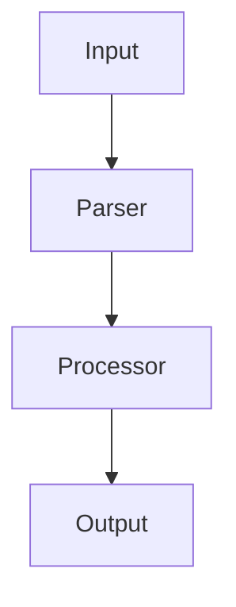

# Technical Blog Template

## Purpose

Use this template when writing technical blogs explaining project implementation.

## Target Audience

Technical readers who want to understand HOW something was built, not just WHAT.

---

## Template Structure

````markdown
# [Title]: How I Built [Project/Feature]

## TL;DR

3-5 bullet points summarizing key takeaways.

## Problem

What problem were you solving? Include:

- Context and background
- Why existing solutions didn't work
- Specific requirements

## Architecture

### High-Level Design

Describe the system architecture. Include a diagram:


````

### Key Components

Explain each major component:

1. **Component 1**: Purpose and responsibility
2. **Component 2**: Purpose and responsibility
3. **Component 3**: Purpose and responsibility

## Implementation

### Step 1: [First Major Step]

Explain with code examples:

```python
def example_function():
    """Docstring explaining purpose."""
    return result
```

Key decisions made and why.

### Step 2: [Second Major Step]

Continue with implementation details...

### Step 3: [Third Major Step]

...and so on.

## Challenges and Solutions

### Challenge 1: [Description]

- **Problem**: What went wrong
- **Solution**: How you fixed it
- **Code**: Show the fix if applicable

### Challenge 2: [Description]

- **Problem**: What went wrong
- **Solution**: How you fixed it

## Results

- Performance metrics
- Before/after comparison
- User feedback

## Lessons Learned

1. Lesson 1
2. Lesson 2
3. Lesson 3

## Future Improvements

What would you do differently or add next?

## Resources

- Links to repo
- Related documentation
- References

```

---

## Tips

1. **Show, don't tell** - Use code snippets liberally
2. **Include diagrams** - Mermaid for architecture, flowcharts
3. **Be honest about failures** - Readers learn from mistakes
4. **Make it reproducible** - Include versions, commands, configs
```
