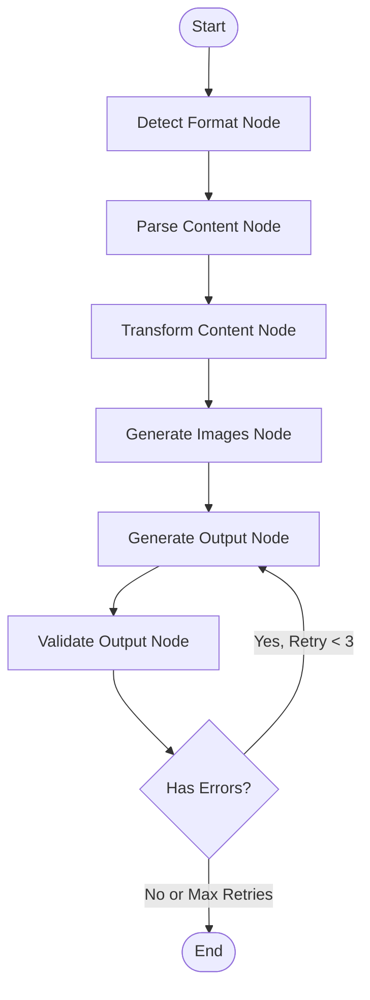

# Document Generator - Complete Architecture Guide

**Production-ready LangGraph-based document generation system with 100% Python implementation**

---

## Table of Contents

1. [System Overview](#system-overview)
2. [Architecture Patterns](#architecture-patterns)
3. [Technology Stack](#technology-stack)
4. [Process Flow](#process-flow)
5. [Component Details](#component-details)
6. [Data Flow](#data-flow)
7. [Integration Points](#integration-points)
8. [Configuration System](#configuration-system)
9. [Error Handling](#error-handling)
10. [Performance Considerations](#performance-considerations)

---

## System Overview

### Purpose

The Document Generator is a sophisticated content transformation pipeline that converts various input formats (PDF, Markdown, DOCX, web articles) into professionally formatted PDF and PowerPoint presentations.

### Key Capabilities

- **Multi-format Input**: PDF, DOCX, PPTX, Markdown, TXT, URLs, Images
- **Multi-format Output**: PDF (ReportLab), PPTX (python-pptx)
- **Intelligent Processing**: LLM-powered content transformation and structuring
- **Image Generation**: Gemini API for section-specific infographics
- **Folder Processing**: Merge multiple files into single cohesive documents
- **Content Caching**: Hash-verified image and content reuse
- **Production Ready**: Comprehensive error handling, retry logic, validation

### Architecture Philosophy

**Clean Architecture + Event-Driven Workflow**

The system combines:
1. **Domain-Driven Design**: Pure business logic in domain layer
2. **Hexagonal Architecture**: Infrastructure at the edges
3. **State Machine Pattern**: LangGraph orchestrates stateful workflow
4. **Provider Pattern**: Pluggable LLM and parser backends

---

## Architecture Patterns

### 1. Three-Layer Clean Architecture

```
┌─────────────────────────────────────────────────────────┐
│                    DOMAIN LAYER                         │
│  (Pure Business Logic - Zero External Dependencies)     │
├─────────────────────────────────────────────────────────┤
│  • Models (WorkflowState, DocumentMetadata)             │
│  • Enums (ImageType, OutputFormat, ContentType)         │
│  • Exceptions (ParseError, GenerationError)             │
│  • Interfaces (Parser, Generator protocols)             │
└─────────────────────────────────────────────────────────┘
                         ▲
                         │
┌─────────────────────────────────────────────────────────┐
│                  APPLICATION LAYER                       │
│    (Use Cases & Orchestration - Domain Rules Only)      │
├─────────────────────────────────────────────────────────┤
│  • Workflow Nodes (detect, parse, transform, etc.)      │
│  • Parsers (markdown, unified)                          │
│  • Generators (PDF, PPTX)                               │
│  • LangGraph State Machine                              │
└─────────────────────────────────────────────────────────┘
                         ▲
                         │
┌─────────────────────────────────────────────────────────┐
│                INFRASTRUCTURE LAYER                      │
│    (External Integrations - Adapters & Services)        │
├─────────────────────────────────────────────────────────┤
│  • LLM Services (OpenAI, Gemini, Claude)                │
│  • Document Adapters (Docling, MarkItDown)              │
│  • Image Generators (Gemini, SVG)                       │
│  • File System                                          │
│  • Logging & Settings                                   │
└─────────────────────────────────────────────────────────┘
```

### 2. LangGraph State Machine Workflow



### 3. Provider Pattern for LLM Integration

```
┌─────────────────────────────────────────────────────┐
│           LLM Content Generator                      │
│  (Strategy Pattern - Multiple Providers)             │
├─────────────────────────────────────────────────────┤
│                                                      │
│  ┌──────────────┐  ┌──────────────┐  ┌───────────┐ │
│  │   Gemini     │  │   OpenAI     │  │  Claude   │ │
│  │  Provider    │  │   Provider   │  │ Provider  │ │
│  └──────────────┘  └──────────────┘  └───────────┘ │
│         │                 │                 │       │
│         └─────────────────┴─────────────────┘       │
│                      │                              │
│              Content Generation                     │
│          (Title, Structure, Merging)                │
└─────────────────────────────────────────────────────┘
```

---

## Technology Stack

### Core Framework

| Component | Technology | Version | Purpose |
|-----------|-----------|---------|---------|
| **Workflow Engine** | LangGraph | 0.2.55 | State machine orchestration |
| **LLM Framework** | LangChain Core | 0.3.25 | LLM integration foundation |
| **Runtime** | Python | 3.11+ | Core language |
| **Package Manager** | uv | latest | Fast dependency management |

### LLM & AI Services

| Service | Technology | Purpose |
|---------|-----------|---------|
| **Content Generation** | Gemini 3 Pro Preview | Content structuring, merging, transformation |
| **Content Generation** | OpenAI GPT-4o | Alternative content provider |
| **Image Generation** | Gemini 3 Pro Image Preview | Section-specific infographics |
| **SVG Generation** | Claude Sonnet 4 (disabled) | Diagram generation (optional) |

### Document Processing

| Component | Technology | Version | Purpose |
|-----------|-----------|---------|---------|
| **Advanced Parsing** | Docling | 2.66.0 | PDF/DOCX/PPTX with OCR, tables |
| **Web Conversion** | MarkItDown | 0.0.1a2 | HTML/web articles to Markdown |
| **PDF Generation** | ReportLab | 4.2.5 | Professional PDF creation |
| **PPTX Generation** | python-pptx | 1.0.2 | PowerPoint presentations |
| **SVG Conversion** | CairoSVG | 2.7.1 | SVG to PNG for PDF embedding |

### Infrastructure

| Component | Technology | Version | Purpose |
|-----------|-----------|---------|---------|
| **Configuration** | Pydantic | 2.10.5 | Settings validation |
| **Logging** | Loguru | 0.7.3 | Structured logging |
| **Environment** | python-dotenv | 1.0.0 | .env file support |
| **Web Parsing** | BeautifulSoup4 | 4.12.3 | HTML parsing |
| **HTTP Client** | Requests | 2.32.3 | API calls |

### Development Tools

| Tool | Purpose |
|------|---------|
| **Linter** | Ruff (replaces Black, isort, flake8) |
| **Type Checker** | MyPy |
| **Testing** | Pytest + pytest-cov |
| **Container** | Docker with multi-stage builds |

---

## Process Flow

### 1. Complete Workflow Overview

```
┌─────────────────────────────────────────────────────────────┐
│                    INPUT SOURCES                            │
├─────────────────────────────────────────────────────────────┤
│  📄 PDF  │  📝 Markdown  │  🌐 URLs  │  📁 Folders         │
└────────────────────────┬────────────────────────────────────┘
                         │
                         ▼
┌─────────────────────────────────────────────────────────────┐
│                 1. DETECT FORMAT                            │
│  • Analyze file extension or URL                            │
│  • Determine input type (pdf, markdown, docx, url)          │
│  • Set metadata (content_type, source_file)                 │
└────────────────────────┬────────────────────────────────────┘
                         │
                         ▼
┌─────────────────────────────────────────────────────────────┐
│                 2. PARSE CONTENT                            │
│  ┌─────────────────────────────────────────────────────┐   │
│  │ Unified Parser (Routes to specific parser)          │   │
│  ├─────────────────────────────────────────────────────┤   │
│  │ PDF/DOCX → Docling (OCR, tables, layout analysis)   │   │
│  │ Web → MarkItDown (HTML to Markdown)                 │   │
│  │ Markdown → Direct extraction                        │   │
│  └─────────────────────────────────────────────────────┘   │
│  Output: Raw markdown content + metadata                   │
└────────────────────────┬────────────────────────────────────┘
                         │
                         ▼
┌─────────────────────────────────────────────────────────────┐
│              3. TRANSFORM CONTENT                           │
│  ┌─────────────────────────────────────────────────────┐   │
│  │ LLM Content Generator (Gemini/OpenAI)               │   │
│  ├─────────────────────────────────────────────────────┤   │
│  │ • Generate meaningful title                         │   │
│  │ • Structure content into sections                   │   │
│  │ • Merge multiple files (folder processing)          │   │
│  │ • Create executive summary                          │   │
│  │ • Clean and format markdown                         │   │
│  │ • Generate content hash for caching                 │   │
│  └─────────────────────────────────────────────────────┘   │
│  Output: Structured content + merged markdown              │
└────────────────────────┬────────────────────────────────────┘
                         │
                         ▼
┌─────────────────────────────────────────────────────────────┐
│              4. GENERATE IMAGES                             │
│  ┌─────────────────────────────────────────────────────┐   │
│  │ Image Generation Workflow                           │   │
│  ├─────────────────────────────────────────────────────┤   │
│  │ 1. Extract sections from merged markdown            │   │
│  │ 2. Sync section IDs with title numbers              │   │
│  │    ("1. Intro" → section_id=1)                      │   │
│  │ 3. Content-aware detection:                         │   │
│  │    • Infographic (lists, comparisons)               │   │
│  │    • Decorative (introductions, conclusions)        │   │
│  │ 4. Check cache (hash-verified):                     │   │
│  │    • Match content_hash → reuse images              │   │
│  │    • Mismatch → regenerate                          │   │
│  │ 5. Generate via Gemini API                          │   │
│  │ 6. Save to topic-specific folder:                   │   │
│  │    output/<topic>/images/section_N_*.png            │   │
│  │ 7. Create manifest.json with hash                   │   │
│  └─────────────────────────────────────────────────────┘   │
│  Output: section_images dict + cached manifest             │
└────────────────────────┬────────────────────────────────────┘
                         │
                         ▼
┌─────────────────────────────────────────────────────────────┐
│              5. GENERATE OUTPUT                             │
│  ┌─────────────────────────────────────────────────────┐   │
│  │ PDF Generator (ReportLab)                           │   │
│  ├─────────────────────────────────────────────────────┤   │
│  │ • Professional cover page (title, metadata)         │   │
│  │ • Table of contents (numbered sections)             │   │
│  │ • Section-synced images (embedded inline)           │   │
│  │ • Custom typography and spacing                     │   │
│  │ • Figure numbering with captions                    │   │
│  │ • Code blocks, tables, quotes                       │   │
│  └─────────────────────────────────────────────────────┘   │
│  ┌─────────────────────────────────────────────────────┐   │
│  │ PPTX Generator (python-pptx)                        │   │
│  ├─────────────────────────────────────────────────────┤   │
│  │ • Title slide                                       │   │
│  │ • Content slides (one per section)                  │   │
│  │ • Images embedded in slides                         │   │
│  │ • Consistent theme and layout                       │   │
│  └─────────────────────────────────────────────────────┘   │
│  Output: PDF or PPTX file                                  │
└────────────────────────┬────────────────────────────────────┘
                         │
                         ▼
┌─────────────────────────────────────────────────────────────┐
│              6. VALIDATE OUTPUT                             │
│  • Check file exists                                        │
│  • Verify file size > 0                                     │
│  • Validate file is readable                                │
│  • Retry up to 3 times on errors                            │
└────────────────────────┬────────────────────────────────────┘
                         │
                         ▼
┌─────────────────────────────────────────────────────────────┐
│                  OUTPUT FILES                               │
├─────────────────────────────────────────────────────────────┤
│  📄 output/<topic>.pdf                                      │
│  📊 output/<topic>.pptx                                     │
│  🖼️  output/<topic>/images/ (generated images)              │
│  📋 output/<topic>/images/manifest.json (cache metadata)    │
└─────────────────────────────────────────────────────────────┘
```

### 2. Folder Processing Flow

**Input**: Folder with multiple files (PDF, DOCX, TXT, Markdown)  
**Output**: Single merged PDF + PPTX

```
Folder: src/data/machine-learning/
├── intro.pdf
├── lecture-notes.docx
└── summary.txt

                    ↓

1. Parse each file individually
   intro.pdf → markdown_1
   lecture-notes.docx → markdown_2
   summary.txt → markdown_3

                    ↓

2. LLM merges all content
   • Analyzes relationships
   • Creates logical structure
   • Generates unified title
   • Produces single merged markdown

                    ↓

3. Generate images from merged content
   • Section IDs sync with merged markdown
   • One image per major section

                    ↓

4. Generate outputs
   output/machine-learning.pdf (combined)
   output/machine-learning.pptx (combined)
   output/machine-learning/images/ (synced)
```

### 3. Image Caching & Reuse Flow

```
┌─────────────────────────────────────────────────────┐
│        Image Generation Decision Tree               │
└─────────────────────────────────────────────────────┘
                         │
          ┌──────────────┴──────────────┐
          │                             │
    Check Setting                  Check Cache
reuse_cache_by_default         manifest.json exists?
          │                             │
          ▼                             ▼
    ┌─────────┐                   ┌─────────┐
    │ Enabled │                   │ Exists  │
    └────┬────┘                   └────┬────┘
         │                             │
         │         ┌───────────────────┘
         │         │
         ▼         ▼
    Compare content_hash
         │
    ┌────┴────┐
    │  Match? │
    └────┬────┘
         │
    ┌────┴────┬────────┐
    │         │        │
  Match    Mismatch  Missing
    │         │        │
    ▼         ▼        ▼
 Reuse    Regenerate Regenerate
 Images    Images     Images
    │         │        │
    └─────────┴────────┘
         │
         ▼
    Save manifest.json
    {
      "content_hash": "sha256...",
      "section_titles": [...],
      "created_at": "2026-01-10T...",
      "image_count": 10
    }
```

---

## Component Details

### Domain Layer (`src/doc_generator/domain/`)

#### 1. Models (`models.py`)

```python
# Core data structures
WorkflowState: TypedDict
    - input_path: str
    - output_format: str
    - raw_content: str
    - structured_content: dict
    - metadata: dict
    - errors: list[str]
    - output_path: Optional[str]
    - _retry_count: int

DocumentMetadata: TypedDict
    - title: str
    - author: Optional[str]
    - generated_date: datetime
    - source_files: list[str]
    - content_type: str
    - content_hash: str (for caching)
```

#### 2. Content Types (`content_types.py`)

```python
# Enums for type safety
OutputFormat = Enum["pdf", "pptx"]
ContentType = Enum["pdf", "markdown", "docx", "web", "text"]
ImageType = Enum["infographic", "decorative", "mermaid", "diagram", "chart"]
```

#### 3. Exceptions (`exceptions.py`)

```python
ParseError: Base exception for parsing failures
GenerationError: Base exception for generation failures
ValidationError: Base exception for validation failures
```

### Application Layer (`src/doc_generator/application/`)

#### 1. Workflow Nodes (`nodes/`)

Each node implements a single responsibility:

**detect_format.py**: Determines input type from file extension or URL
**parse_content.py**: Routes to appropriate parser and extracts content
**transform_content.py**: Structures content with LLM, merges files
**generate_images.py**: Creates section images via Gemini API
**generate_output.py**: Creates PDF or PPTX from structured content
**validate_output.py**: Ensures output file is valid

#### 2. Parsers (`parsers/`)

**unified_parser.py**: Main entry point, routes to specific parsers
**markdown_parser.py**: Handles .md files with frontmatter
**web_parser.py**: Extracts content from URLs

#### 3. Generators (`generators/`)

**pdf_generator.py**:
- Cover page with metadata
- Table of contents
- Section-synced images
- Custom ReportLab styles
- Figure numbering
- Page breaks and spacing

**pptx_generator.py**:
- Title slide
- Content slides (one per section)
- Image embedding
- Consistent theming

### Infrastructure Layer (`src/doc_generator/infrastructure/`)

#### 1. LLM Services

**llm_content_generator.py**:
- Multi-provider support (Gemini, OpenAI, Claude)
- Content merging for folders
- Title generation
- Structure creation
- Usage tracking

**llm_service.py**: Legacy service (being deprecated)

**gemini_image_generator.py**:
- Image generation via Gemini API
- Rate limiting (20 images/minute)
- Request delay (3 seconds)
- Base64 encoding for embedding

#### 2. Document Adapters

**docling_adapter.py**:
- Advanced PDF/DOCX/PPTX parsing
- OCR support
- Table extraction
- Layout analysis

**markitdown_adapter.py**:
- Web article to Markdown
- HTML cleaning
- Content extraction

#### 3. Utilities

**pdf_utils.py**: ReportLab helpers (styles, flowables, figures)
**pptx_utils.py**: python-pptx helpers (layouts, formatting)
**svg_validator.py**: SVG validation (when SVG generation enabled)

---

## Data Flow

### State Management

**LangGraph State** flows through all nodes:

```
Initial State:
{
    "input_path": "data/file.pdf",
    "output_format": "pdf",
    "metadata": {}
}

After detect_format:
{
    ...,
    "metadata": {
        "content_type": "pdf",
        "source_file": "file.pdf"
    }
}

After parse_content:
{
    ...,
    "raw_content": "# Title\n\nContent...",
    "metadata": {
        ...,
        "parser": "docling"
    }
}

After transform_content:
{
    ...,
    "structured_content": {
        "title": "Extracted Title",
        "markdown": "# Merged Content\n\n...",
        "sections": [...]
    },
    "metadata": {
        ...,
        "content_hash": "sha256..."
    }
}

After generate_images:
{
    ...,
    "structured_content": {
        ...,
        "section_images": {
            1: {"path": "...", "type": "infographic"},
            2: {"path": "...", "type": "decorative"}
        }
    }
}

After generate_output:
{
    ...,
    "output_path": "output/file.pdf"
}

After validate_output:
{
    ...,
    "errors": []  # Empty if successful
}
```

---

## Integration Points

### 1. LLM Provider Integration

```python
# Configuration-driven provider selection
# config/settings.yaml
llm:
  content_provider: "gemini"  # or "openai", "claude"
  content_model: "gemini-3-pro-preview"

# Automatic routing in llm_content_generator.py
if provider == "gemini":
    client = genai.Client(api_key=gemini_api_key)
    response = client.models.generate_content(...)
elif provider == "openai":
    client = OpenAI(api_key=openai_api_key)
    response = client.chat.completions.create(...)
```

### 2. Image Generation Integration

```python
# Gemini API for images
# config/settings.yaml
image_generation:
  default_provider: "gemini"
  gemini_model: "gemini-3-pro-image-preview"
  gemini_rate_limit: 20
  gemini_request_delay: 3.0

# Generation with caching
1. Check manifest.json for content_hash
2. If match: load existing images
3. If mismatch: regenerate all
4. Save new manifest with hash
```

### 3. Document Parser Integration

```python
# Docling for advanced parsing
if file_ext in ['.pdf', '.docx', '.pptx']:
    converter = DocumentConverter()
    result = converter.convert(file_path)
    markdown = result.document.export_to_markdown()

# MarkItDown for web content
if is_url(input_path):
    converter = MarkItDown()
    result = converter.convert(url)
    markdown = result.text_content
```

---

## Configuration System

### Settings Hierarchy

```
1. Default Values (in Pydantic models)
   ↓
2. config/settings.yaml (committed)
   ↓
3. .env file (local, not committed)
   ↓
4. Environment Variables (highest priority)
   DOC_GENERATOR_LLM__MODEL="gemini-3-pro-preview"
```

### Key Settings

**LLM Configuration**:
```yaml
llm:
  model: "gemini-3-pro-preview"
  content_provider: "gemini"
  content_model: "gemini-3-pro-preview"
  max_summary_points: 5
  temperature_summary: 0.3
```

**Image Generation**:
```yaml
image_generation:
  default_provider: "gemini"
  gemini_model: "gemini-3-pro-image-preview"
  gemini_rate_limit: 20
  enable_decorative_headers: true
  enable_infographics: true
```

**Generator Settings**:
```yaml
generator:
  input_dir: "src/data"
  output_dir: "src/output"
  default_output_format: "pdf"
  max_retries: 3
  reuse_cache_by_default: true
```

---

## Error Handling

### Retry Strategy

```python
# LangGraph conditional edge for retry logic
def should_retry(state: WorkflowState) -> str:
    errors = state.get("errors", [])
    retry_count = state.get("_retry_count", 0)
    
    # Max 3 retries
    if retry_count >= 3:
        return "end"
    
    # Only retry generation/validation errors
    if "Generation failed" in last_error:
        state["_retry_count"] = retry_count + 1
        return "retry"
    
    return "end"
```

### Error Types

**Parse Errors**: Non-retryable (invalid input)
**Generation Errors**: Retryable (LLM timeout, API errors)
**Validation Errors**: Retryable (file corruption, size issues)

### Logging Strategy

```python
# Structured logging with Loguru
logger.info("Processing started", input=input_path)
logger.debug("Detected format", format=content_type)
logger.warning("Retrying generation", attempt=retry_count)
logger.error("Generation failed", error=str(e))
logger.success("PDF generated", path=output_path)
```

---

## Performance Considerations

### 1. Image Caching

**Without Caching**:
- 10 sections × 5 seconds/image = 50 seconds
- 10 API calls × $0.02 = $0.20

**With Caching** (content_hash match):
- Load from disk < 1 second
- 0 API calls × $0.00 = $0.00

### 2. Content Hashing

```python
# SHA-256 hash of merged markdown
content_hash = hashlib.sha256(
    merged_markdown.encode()
).hexdigest()

# Used for:
# 1. Image cache validation
# 2. Avoiding redundant processing
# 3. Detecting content changes
```

### 3. Rate Limiting

**Gemini API**:
- Max 20 requests/minute
- 3 second delay between requests
- Automatic tracking and throttling

### 4. Batch Processing

**Folder Processing**:
- Parse all files concurrently
- Merge content in single LLM call
- Generate images in sequence (rate limited)
- Output: Single PDF + PPTX (no per-file overhead)

---

## Deployment Architecture

### Local Development

```bash
# Virtual environment
python 3.11+ with uv package manager

# Dependencies
All from pyproject.toml

# Configuration
.env file + config/settings.yaml
```

### Docker Deployment

```dockerfile
# Multi-stage build
FROM python:3.11-slim AS builder
  → Install uv
  → Install dependencies

FROM python:3.11-slim AS runtime
  → Copy dependencies from builder
  → Copy application code
  → Set entry point
```

### Production Considerations

1. **API Keys**: Use secrets manager (AWS Secrets, HashiCorp Vault)
2. **File Storage**: Mount persistent volume for output/
3. **Logging**: Stream to centralized logging (CloudWatch, ELK)
4. **Monitoring**: Track LLM usage, API costs, processing time
5. **Scaling**: Stateless design allows horizontal scaling

---

## Summary

### Key Strengths

✅ **Clean Architecture**: Testable, maintainable, extensible
✅ **Provider Flexibility**: Swap LLM providers via configuration
✅ **Intelligent Caching**: Hash-verified image and content reuse
✅ **Production Ready**: Retry logic, validation, comprehensive logging
✅ **Pure Python**: No Node.js, runs anywhere Python runs
✅ **Folder Processing**: Merge multiple files intelligently

### Technology Highlights

🚀 **LangGraph**: State machine orchestration
🤖 **Gemini API**: Content generation + image generation
📄 **Docling**: Advanced PDF parsing (OCR, tables)
🎨 **ReportLab**: Professional PDF output
📊 **python-pptx**: Native PPTX generation

### Use Cases

1. **Documentation Generation**: Convert raw docs to polished PDFs
2. **Presentation Creation**: Generate slides from technical content
3. **Content Aggregation**: Merge multiple sources into unified documents
4. **Report Automation**: Transform data exports into formatted reports
5. **Knowledge Base Publishing**: Convert markdown docs to distributable PDFs

---

**For more details, see:**
- `README.md` - Quick start and usage
- `Quickstart.md` - Hands-on guide
- `docs/guides/` - Detailed guides
- `src/doc_generator/` - Source code
